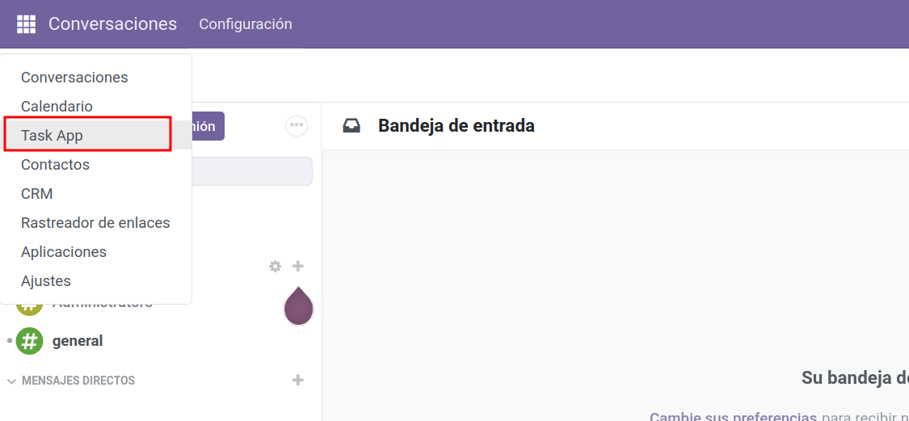

# Añadir accesos en `ir.model.access.csv` para `task_model` y verificar vistas por defecto

En este paso daremos **permisos de acceso** al modelo `task_model` para que los **usuarios internos** puedan ver y gestionar registros desde los menús creados en el paso 2. Después **actualizaremos** el módulo y comprobaremos que Odoo **genera vistas por defecto** (`list` y `form`) aunque no hayamos definido vistas personalizadas.

---

## Crear la carpeta `security/` y el archivo `ir.model.access.csv`

Estructura esperada del módulo:

```
task_app/
├─ __init__.py
├─ __manifest__.py
├─ models/
│  ├─ __init__.py
│  └─ task_model.py
├─ views/
│  └─ task_menus_actions.xml
└─ security/
   └─ ir.model.access.csv
```

Crea el archivo **`task_app/security/ir.model.access.csv`** con el contenido mínimo:

```csv
id,name,model_id:id,group_id:id,perm_read,perm_write,perm_create,perm_unlink
access_task_app_task_model_user,task_app_task_model,model_task_app_task_model,base.group_user,1,1,1,1
```

**Explicación de columnas:**

  - `model_task_app_task_model`: es el **External ID** que Odoo genera automáticamente para el modelo `task_model` (patrón: `model_` + nombre del modelo con `.` → `_`).
  - `base.group_user`: grupo **Usuarios Internos**.
  - `perm_read/write/create/unlink`: permisos CRUD (1 = permitido, 0 = denegado).

> Si quisieras dar acceso solo lectura: `1,0,0,0`.  
> Para restringir por filas (dominios), usa **Reglas de registro (`ir.rule`)** en otro XML (no es necesario en este paso).

---

## Añadir el `access.csv` al `__manifest__.py`

Edita `task_app/__manifest__.py` y asegúrate de que **`security/ir.model.access.csv`** aparece **antes** que las vistas/menús en `data`:

```python
"data": [
    "security/ir.model.access.csv",
    "views/task_menus_actions.xml",
],
```

> El **orden importa**: primero seguridad, luego vistas/acciones/menús.

---

## Actualizar el módulo

### Desde la interfaz
1. **Ajustes → Activar modo desarrollador**.
2. **Apps → Actualizar lista de aplicaciones**.
3. **Actualizar** el módulo **task_app**.

### Con Docker (CLI)
Usando dos contenedores (`web` y `db`), ejecuta (ajusta nombres/base/credenciales):

```bash
docker exec -it odoo18_web_1 sh -lc '
  odoo     --db_host=db     --db_port=5432     --db_user=odoo     --db_password="$(cat /run/secrets/postgresql_password)"     --addons-path=/usr/lib/python3/dist-packages/odoo/addons,/mnt/extra-addons     -d odoodb -u task_app --stop-after-init
'
```

> `--stop-after-init` evita conflictos con el puerto 8069 si el servidor ya está corriendo en el contenedor.

---

## Verificar que podemos acceder a los menús y al modelo

1. En la UI, abre **Task App → Tasks**.  
2. Ahora, como **usuario interno**, deberías:
   - **Ver** la lista de registros de `task_model` (vista `list` por defecto).
   - **Crear** un registro (botón **Nuevo**).
   - **Editar** y **Eliminar** registros (según los permisos definidos).

<figure markdown="span">
    {width="100%" }
    <figcaption>Acceso a task_model </figcaption>
</figure>

> Si Odoo **no muestra** la vista, revisa que estés usando un usuario con **grupo** `Usuarios internos` y que el CSV tenga la línea con `base.group_user` correctamente escrita.

---

## Confirmar que las vistas por defecto existen (sin haber creado vistas propias)

Aunque no definiste vistas `<list>`/`<form>`, Odoo 18 **renderiza vistas por defecto**. Puedes comprobar:

- **Ajustes → Técnico → Vistas** → filtra por **Modelo = task.model**.  
  *Lo habitual es que no haya vistas personalizadas listadas aún.*  
- Abre un registro desde el menú **Task App → Tasks**: verás una **lista** y al abrir un elemento, un **formulario** básicos.

> Estos layouts “por defecto” los genera Odoo en tiempo de ejecución si no encuentra vistas específicas para el modelo.


## 📝 Actividad
!!! Question "Añadir permisos"
    1. Añade los permisos al modelo `task_model`
    2. Comprueba que puedas acceder