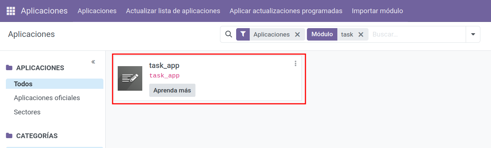
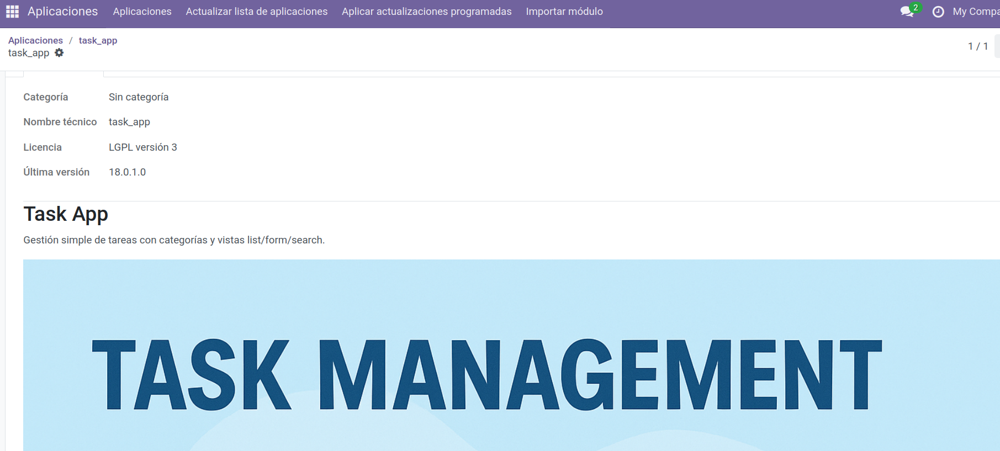

# 🎨 Añadir un icono a tu app

## Prepara el icono
- **Formato:** PNG (mejor con fondo transparente).
- **Tamaño recomendado:** cuadrado, 512×512 px o 1024×1024 px.
- **Nombre y ubicación:** `static/description/icon.png`.

Estructura:
```
task_app/
├─ __manifest__.py
└─ static/
   └─ description/
      ├─ icon.png          <-- icono que verá Odoo en Apps
      ├─ banner.png        <-- (opcional) imagen grande de portada
      ├─ screenshot1.png   <-- (opcional) capturas
      └─ index.html        <-- (opcional) landing de la app
```

> Odoo detecta automáticamente `static/description/icon.png` para el icono del mosaico en **Apps**.  
> No necesitas declarar el icono en el manifest.

<figure markdown="span">
    {width="40%" }
    <figcaption>Icono para la app </figcaption>
</figure>


---

## (Opcional) Landing y galería
- **Landing:** crea `static/description/index.html` (aparece al abrir la ficha de la app).
- **Galería de imágenes:** puedes referenciarlas desde el manifest con la clave `images`.

Ejemplo mínimo de `index.html`:
```html
<!doctype html>
<html>
  <head><meta charset="utf-8"><title>Task App</title></head>
  <body style="font-family:system-ui;line-height:1.5">
    <h1>Task App</h1>
    <p>Gestión simple de tareas con categorías y vistas list/form/search.</p>
    
    <ul>
      <li>Modelo: <code>task_app.task_model</code></li>
      <li>Categorías: <code>task_app.category_model</code></li>
    </ul>
  </body>
</html>
```

Manifest con galería:
```python
# __manifest__.py
{
    "name": "Task App",
    "version": "18.0.1.0.0",
    "depends": ["base"],
    "data": [
        "security/ir.model.access.csv",
        "views/task_menus_actions.xml",
        "views/task_views.xml",
        "views/task_search.xml",
    ],
    "images": [  # (opcional) se muestran en la ficha de la app
        "static/description/banner.png"    
    ],
    "application": True,
}
```

---

## Recargar para verlo en Odoo

### Desde la interfaz
1) **Ajustes → Activar modo desarrollador**  
2) **Apps → Actualizar lista de aplicaciones**  
3) Busca tu módulo y abre la ficha: verás el **icono** y, si lo añadiste, la **landing** e **imágenes**.

### Con Docker (CLI)
```bash
docker exec -it odoo18_web_1 sh -lc '
  odoo     --db_host=db --db_port=5432     --db_user=odoo --db_password="$(cat /run/secrets/postgresql_password)"     --addons-path=/usr/lib/python3/dist-packages/odoo/addons,/mnt/extra-addons     -d odoodb -u task_app --stop-after-init
'
```
<figure markdown="span">
    {width="80%" }
    <figcaption>Task App </figcaption>
</figure>
<figure markdown="span">
    {width="80%" }
    <figcaption>Detalle de información de Task App </figcaption>
</figure>


> Si no ves el cambio: limpia caché del navegador o recarga con Ctrl+F5. Verifica que el archivo esté en la ruta correcta del contenedor:
> `docker exec -it odoo18_web_1 ls -la /mnt/extra-addons/task_app/static/description/`

---

## Consejos de diseño
- Fondo transparente y bordes suaves para integrarse con el tema.
- Evita mucho texto dentro del icono; prioriza una **silueta** clara.
- Mantén el archivo ligero (≤ 200 KB si puedes).


## 📝 Actividad
!!! Question "Darle un toque profesional..."
    1. Añade un icono y genera un archivo .html con la descripción de la app
