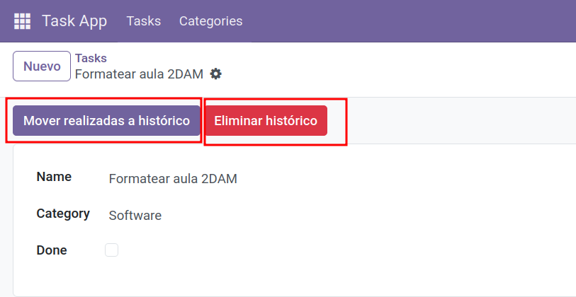

# Lógica de negocio 

Odoo tiene un campo booleano especial llamado **`active`** que se usa para **archivar** o **desarchivar** registros.  
Cuando `active=False`, el registro sigue existiendo en la base de datos pero **no aparece** en las vistas por defecto.

📚 **Referencia oficial**:  
- [Documentación Odoo — Campo active](https://www.odoo.com/documentation/18.0/developer/reference/backend/orm.html#common-fields)  
- [Documentación Odoo — Botones en vistas](https://www.odoo.com/documentation/18.0/developer/reference/backend/views.html#buttons)  

---

## Modificar el modelo `task_model`

**Ruta:** `task_app/models/task_model.py`

```python
from odoo import fields, models

class TaskModel(models.Model):
    _name = "task.model"
    _description = "Task (basic model)"

    name = fields.Char(string="Name", required=True, index=True)
    description = fields.Text(string="Description")
    is_done = fields.Boolean(string="Done", default=False)
    category_id = fields.Many2one(
        comodel_name="category.model",
        string="Category",
        ondelete="set null",
        index=True,
    )

    # Campo especial para activar/desactivar (archivar)
    active = fields.Boolean(default=True)

    # Método para mover tareas realizadas a histórico
    def action_archive_done_tasks(self):
        done_tasks = self.search([('is_done', '=', True), ('active', '=', True),('create_uid', '=', self.env.user.id)])
        done_tasks.write({'active': False})
        return True

    # Método para eliminar todas las tareas del histórico
    def action_delete_archived_tasks(self):
        archived_tasks = self.search([('active', '=', False),('create_uid', '=', self.env.user.id)])
        archived_tasks.unlink()
        return True
```

📌 **Notas**:

- `search` devuelve un recordset sobre el que podemos hacer `write` o `unlink`.  
- `active=False` significa que el registro está archivado, pero no eliminado.  

---

## Añadir botones a la vista

**Ruta:** `task_app/views/task_views.xml`

```xml
<odoo>
  <record id="view_task_model_form" model="ir.ui.view">
    <field name="name">task_app.task_model_form</field>
    <field name="model">task_app.task_model</field>
    <field name="arch" type="xml">
      <form string="Task">
        <header>
          <!-- Botón para archivar todas las tareas realizadas -->
          <button name="action_archive_done_tasks"
                  string="Mover realizadas a histórico"
                  type="object"
                  class="btn-primary"
                  confirm="¿Estás seguro de que quieres mover tus tareas realizadas al histórico?"/>

          <!-- Botón para eliminar todas las tareas archivadas -->
          <button name="action_delete_archived_tasks"
                  string="Eliminar histórico"
                  type="object"
                  class="btn-danger"
                  confirm="⚠️ Esta acción eliminará todas tus tareas archivadas. ¿Deseas continuar?"/>
        </header>

        <sheet>
          <group>
            <group>
              <field name="name"/>
              <field name="category_id"/>
              <field name="is_done"/>
              <field name="active"/>
            </group>
            <group>
              <field name="description"/>
            </group>
          </group>
        </sheet>
      </form>
    </field>
  </record>
</odoo>
```

📌 **Explicación de atributos**:

- `name="action_archive_done_tasks"` → nombre del método Python que se ejecuta.  
- `type="object"` → indica que se llama a un método del modelo (no es una acción estándar).  
- `class="btn-primary"` / `btn-danger` → estilos de color para el botón.  

---

## Actualizar el módulo

```bash
docker exec -it odoo18_web_1 sh -lc '
  odoo     --db_host=db     --db_port=5432     --db_user=odoo     --db_password="$(cat /run/secrets/postgresql_password)"     --addons-path=/usr/lib/python3/dist-packages/odoo/addons,/mnt/extra-addons     -d odoodb -u task_app --stop-after-init
'
```

---

## Probar en la interfaz

1. Crear varias tareas con `is_done=True` y `is_done=False`.  
2. Abrir cualquier tarea y pulsar **"Mover realizadas a histórico"**.  
3. Comprobar que las realizadas desaparecen de la vista (porque `active=False`).  
4. Pulsar **"Eliminar histórico"** para borrarlas de la base de datos.  

<figure markdown="span">
    {width="80%" }
    <figcaption>Botones </figcaption>
</figure>

---

!!! tip "**Tip**" 
    Si quieres permitir ver también las tareas archivadas, activa el filtro **"Incluye archivadas"** en la vista lista (Odoo lo añade automáticamente si existe el campo `active`).  

## 📝 Actividad
!!! Question "Crear botones"
    1. Añade los botones para mover tareas realizadas al histórico y eliminar del histórico.
