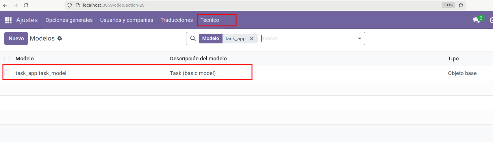
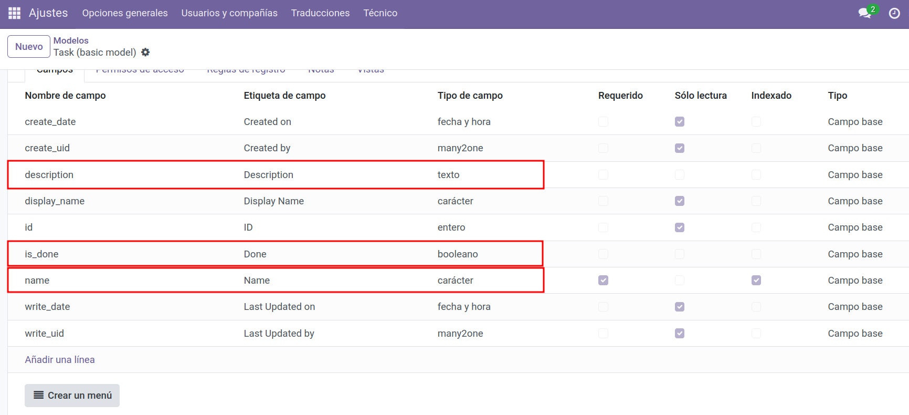
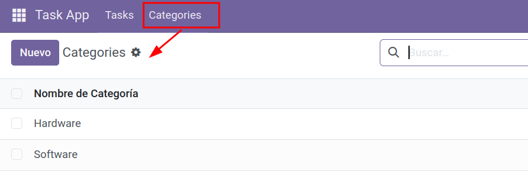

# Crear un modelo nuevo `task_model` en Odoo 

Este tutorial crea un **modelo ORM** llamado `task.model` con tres campos:
- `name` (Char) — nombre de la tarea
- `description` (Text) — descripción
- `is_done` (Boolean) — si la tarea está realizada

> Objetivo: que el modelo quede **registrado** en Odoo y podamos **verlo** desde el **Menú técnico** (modo desarrollador), **sin** añadir todavía vistas ni menús de la app.

---

## Estructura previa del módulo

Suponemos que ya tienes un módulo (p. ej. `task_app`) visible en Odoo con el manifest mínimo. La estructura debería incluir al menos:

```
task_app/
├─ __init__.py
├─ __manifest__.py
└─ models/
   └─ __init__.py
```

Si no existe `models/` o alguno de los `__init__`, créalos ahora (vacíos).

---

## Crear el archivo del modelo

Crea el fichero **`task_app/models/task_model.py`** con el siguiente contenido:

```python
# task_app/models/task_model.py
from odoo import fields, models

class TaskModel(models.Model):
    _name = "task_app.task_model"
    _description = "Task (basic model)"

    name = fields.Char(string="Name", required=True, index=True)
    description = fields.Text(string="Description")
    is_done = fields.Boolean(string="Done", default=False)
```

**Notas:**
- `_name` es el **nombre técnico del modelo** (`task_app.task.model`) → en PostgreSQL la tabla será `task_app_task_model`.
- Hemos marcado `name` como obligatorio y con índice para búsquedas ágiles.
- Este modelo **aún no tendrá vistas** ni accesos para usuarios finales; **solo** lo veremos por el **Menú técnico**.

---

## Importar el modelo en los `__init__`

Asegúrate de **importar el paquete `models`** en el `__init__.py` de la **raíz** del módulo, y de **importar el archivo** `task_model` en el `__init__.py` de la **carpeta `models/`**.

**`task_app/models/__init__.py`**
```python
from . import task_model
```

> Si ya existían estas líneas, no hace falta cambiarlas.

---

## Actualizar la app (registrar el nuevo modelo)

### 4.1. Desde la interfaz
1. Entra a Odoo y **activa el Modo desarrollador** (Ajustes → Activar modo desarrollador).
2. Ve a **Apps → Actualizar lista de aplicaciones**.
3. Busca tu módulo (p. ej., **task_app**) y pulsa **Actualizar** (o **Instalar** si aún no estaba instalado).

### 4.2. Con Docker (CLI)
Si usas dos contenedores (`web` con Odoo y `db` con PostgreSQL), ejecuta (ajusta nombres/base/credenciales a tu entorno):

```bash
docker exec -it odoo18_web_1 sh -lc '
  odoo     --db_host=db     --db_port=5432     --db_user=odoo     --db_password="$(cat /run/secrets/postgresql_password)"     --addons-path=/usr/lib/python3/dist-packages/odoo/addons,/mnt/extra-addons     -d odoodb -u task_app --stop-after-init
'
```

- `-u task_app` **actualiza** el módulo para que Odoo **registre** el nuevo modelo.
- `--stop-after-init` evita conflictos si el servidor web ya está corriendo en el contenedor.

---

## Comprobar el modelo y sus campos en el Menú técnico

1. Con **Modo desarrollador** activo, ve a:  
   **Ajustes → Técnico → Modelos** y busca **`task.model`**.
2. Ábrelo y revisa la pestaña **Campos**. Deberías ver:
   - `name` (Char, requerido, index)
   - `description` (Text)
   - `is_done` (Boolean, por defecto `False`)
3. (Opcional) En **Ajustes → Técnico → Modelos → Campos**, filtra por **Modelo = task.model** para listar sus campos.

<figure markdown="span">
    {width="100%" }
</figure>

<figure markdown="span">
    {width="100%" }
    <figcaption>Modelo task_model </figcaption>
</figure>


> **Importante:** aún **no verás** este modelo en menús de la app ni podrás trabajar con él desde la UI estándar hasta que creemos **vistas** (list/form) y **acciones/menús**, y definamos **accesos** en `security/ir.model.access.csv`.

---

## Verificar en PostgreSQL

Si tienes acceso a la BD, comprueba que la tabla existe (el nombre lo genera Odoo a partir del modelo, reemplazando `.` por `_`):

```sql
-- Tabla esperada: task_app_task_model
SELECT column_name, data_type
FROM information_schema.columns
WHERE table_name = 'task_app_task_model'
ORDER BY ordinal_position;
```

## 📝 Actividades
!!! Question "Crear un modelo"
    1. Crea el modelo `task_model` con los campos descritos anteriormente
    2. Crea otro modelo `category_model` para que podamos categorizar las tareas. En este modelo tendremos un nombre de categoría, una descripción y una imagen que represente la categoría.
    3. Añadir un nuevo campo en el modelo `task_model` llamado category_id que haga referencia al modelo de categorías mediante una relación `Many2one`.
    4. Añade los menús y las vistas que creas necesarias para que se pueda consultar la información.


<figure markdown="span">
    {width="100%" }
    <figcaption>Modelo de Categorías </figcaption>
</figure>
