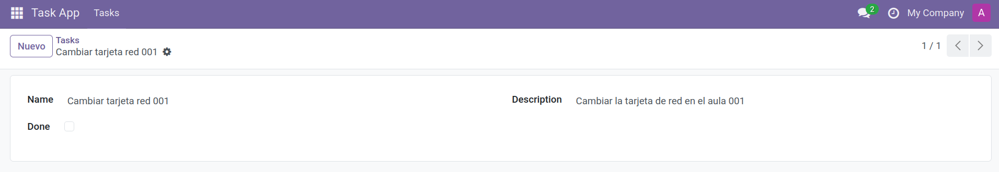
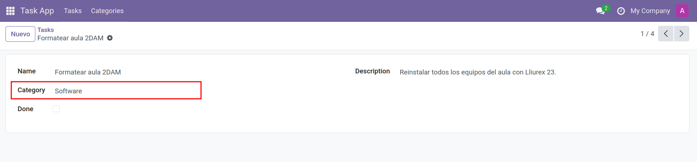

# Redefinir las vistas `<list>` y `<form>` de `task.model` (archivo separado)

En este paso creamos **un archivo de vistas** *independiente* del archivo de menús/acciones para mantener la estructura limpia:
  
  - Archivo de **menús/acción**: `views/task_menus_actions.xml` (ya creado en el paso 2).
  - **Nuevo archivo de vistas** del modelo: `views/task_views.xml` (lo creamos ahora).

> Recuerda: en **Odoo 18** la vista de lista usa `<list>` (no `<tree>`).

---

## Crear `views/task_views.xml` con las vistas `list` y `form`

**Ruta:** `task_app/views/task_views.xml`

```xml
<odoo>
  <!-- Vista LIST para task_model -->
  <record id="view_task_model_list" model="ir.ui.view">
    <field name="name">task_app.task_model_list</field>
    <field name="model">task_app.task_model</field>
    <field name="arch" type="xml">
      <list string="Tasks" default_order="is_done asc, name asc">
        <field name="name"/>
        <field name="is_done"/>
      </list>
    </field>
  </record>

  <!-- Vista FORM para task_model -->
  <record id="view_task_model_form" model="ir.ui.view">
    <field name="name">task_app.task_model_form</field>
    <field name="model">task_app.task_model</field>
    <field name="arch" type="xml">
      <form string="Task">
        <sheet>
          <group>
            <group>
              <field name="name"/>
              <field name="is_done"/>
            </group>
            <group>
              <field name="description"/>
            </group>
          </group>
        </sheet>
      </form>
    </field>
  </record>
</odoo>
```

**Notas rápidas**
- `default_order` en `<list>` ordena primero por `is_done` y luego por `name`.
- En el `<form>` usamos dos grupos para separar **datos principales** y **descripción**.

---

## Añadir el archivo de vistas al `__manifest__.py`

Edita **`task_app/__manifest__.py`** y **mantén el orden**: primero seguridad, luego acciones/menús y **después** (o también) las vistas. Puedes poner las vistas al final.

```python
"data": [
    "security/ir.model.access.csv",
    "views/task_menus_actions.xml",  # acción y menús (ya creado)
    "views/task_views.xml",          # <-- NUEVO: vistas list y form
],
```

> Si tenías `data: []`, añade ambas rutas. No listes archivos que no existan.

---

## Actualizar el módulo

### Desde la interfaz
1. **Ajustes → Activar Modo desarrollador**.
2. **Apps → Actualizar lista de aplicaciones**.
3. **Actualizar** el módulo **task_app**.

### Con Docker (CLI)
```bash
docker exec -it odoo18_web_1 sh -lc '
  odoo     --db_host=db     --db_port=5432     --db_user=odoo     --db_password="$(cat /run/secrets/postgresql_password)"     --addons-path=/usr/lib/python3/dist-packages/odoo/addons,/mnt/extra-addons     -d odoodb -u task_app --stop-after-init
'
```

---

## Verificar que las vistas se han redefinido

1. **Abrir menú**: *Task App → Tasks*.  
   - Verás la **lista** con columnas `name` e `is_done` y el **formulario** con `name`, `is_done` y `description` en dos grupos.
2. **Modo desarrollador → Técnico → Vistas**:
   - Filtra por **Modelo = task_model** y comprueba que existen:
     - **`view_task_model_list`** (tipo **list**)
     - **`view_task_model_form`** (tipo **form**)
3. **(Opcional)** En **Técnico → Acciones de Ventana** abre `action_task_model` y en la pestaña **Vistas** verifica el **orden** si añadiste los enlaces `ir.actions.act_window.view`.

<figure markdown="span">
    {width="100%" }
    <figcaption> Vista list/form `task_model` </figcaption>
</figure>

---

## 📝 Actividad
!!! Question "Crear vistas list/form"
    1. Crea una vista para list y otra para form al modelo `task_model`  
    2. Crea otro modelo `category_model` para que podamos categorizar las tareas. En este modelo tendremos un nombre de categoría, una descripción y una imagen que represente la categoría.
    3. Añadir un nuevo campo en el modelo `task_model` llamado category_id que haga referencia al modelo de categorías mediante una relación `Many2one`.
    4. Añade los menús y las vistas que creas necesarias para que se pueda consultar la información.


<figure markdown="span">
    {width="100%" }
    <figcaption>Modelo de Categorías </figcaption>
</figure>
<figure markdown="span">
    {width="100%" }
    <figcaption>Modelo de tareas con el campo Many2one </figcaption>
</figure>
