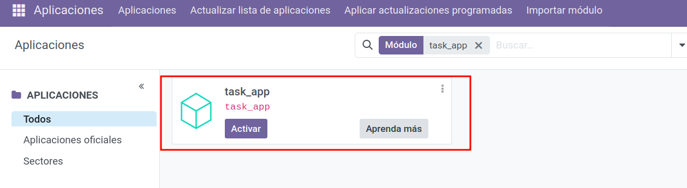

# Mi primera app en Odoo

Comenzaremos a crear **paso a paso** un módulo para Odoo usando `scaffold`, explicando **cada carpeta/archivo**, cómo se conectan entre sí y **buenas prácticas**. Tomaremos como hilo conductor una app sencilla de **gestión de tareas** (*task_app*) inspirada en el manifiesto del repo:  
**Referencia:** [https://github.com/alapvi/task_app/blob/master/__manifest__.py](https://github.com/alapvi/task_app/blob/master/__manifest__.py)

> 📚 Documentación oficial Odoo 18 (enlaces clave):
> - **Estructura de módulos y manifiesto:** https://www.odoo.com/documentation/18.0/developer/tutorials/getting_started.html#module-structure  
> - **ORM / Modelos / Campos / Relaciones:** https://www.odoo.com/documentation/18.0/developer/reference/backend/orm.html  
> - **Vistas (XML):** https://www.odoo.com/documentation/18.0/developer/reference/backend/views.html  
> - **Acciones y menús:** https://www.odoo.com/documentation/18.0/developer/reference/backend/actions.html  
> - **Seguridad (accesos y reglas):** https://www.odoo.com/documentation/18.0/developer/reference/backend/security.html  
> - **Datos (XML/CSV, carga de registros):** https://www.odoo.com/documentation/18.0/developer/reference/backend/data.html  

---

## Generar el esqueleto con `scaffold` (qué crea y por qué)

```bash
cd /opt/odoo18/addons
docker exec -it odoo18_web_1 odoo scaffold task_app /mnt/extra-addons
```
**Qué genera** (estructura mínima):
```
task_app/
├─ __init__.py                 # inicializa el paquete Python
├─ __manifest__.py             # manifiesto del módulo (metadatos)
├─ controllers/                # rutas web (HTTP) opcionales
│  ├─ __init__.py
│  └─ controllers.py
├─ models/                     # modelos ORM (tablas, lógica de negocio)
│  ├─ __init__.py
│  └─ models.py
├─ views/                      # vistas XML (UI)
│  └─ templates.xml
└─ static/description/         # icono y landing de la app en el lanzador
   ├─ icon.png
   └─ index.html
```
**Por qué esta estructura:** Odoo detecta módulos por **carpetas Python** con `__manifest__.py`. Separar `models/`, `views/`, `controllers/` refleja el **MVC**.

> 🔎 Tip: crea carpetas adicionales **cuando aporten valor**: `security/`, `data/`, `report/`, `wizard/`, `static/src/` (JS/CSS), `i18n/`, `tests/`…

---

## Fichero `__manifest__.py` 

Archivo **obligatorio** que describe tu módulo y **cómo se carga**.
```python
# -*- coding: utf-8 -*-
{
    'name': "task_app",

    'summary': "Short (1 phrase/line) summary of the module's purpose",

    'description': """
       Long description of module's purpose
    """,

    'author': "My Company",
    'website': "https://www.yourcompany.com",

    # Categories can be used to filter modules in modules listing
    # Check https://github.com/odoo/odoo/blob/15.0/odoo/addons/base/data/ir_module_category_data.xml
    # for the full list
    'category': 'Uncategorized',
    'version': '0.1',

    # any module necessary for this one to work correctly
    'depends': ['base'],

    # always loaded
    'data': [
        # 'security/ir.model.access.csv',
        'views/views.xml',
        'views/templates.xml',
    ],
    # only loaded in demonstration mode
    'demo': [
        'demo/demo.xml',
    ],
    'application': True,
    'installable': True
}
```
**Claves:**

- `depends`: garantiza que los modelos/recursos de otros módulos estén disponibles antes de cargar el tuyo.
- `data`: orden **importa** (primero seguridad, luego vistas/menús/acciones).
- Versionado recomendado **MAJOR.MINOR.PATCH** alineado con versión de Odoo.
- Cambiamos el summary añadiendo una breve descripción
- Añadimos una descripción más amplia
- Modificamos el `author`
- Añadimos `application`y `installable`

---

## Recargar para comprobar que la app aparece

### Desde la interfaz
1. Entra en **Odoo → Ajustes** y activa **Modo desarrollador**.
2. Ve a **Apps → Actualizar lista de aplicaciones**.
3. Quita el filtro “Apps” si no la ves y busca **Task App**.

<figure markdown="span">
    {width="90%" }
    <figcaption>Instalar app en Odoo</figcaption>
</figure>

### Con Docker (CLI)

**Actualizar lista + instalar** (si ya tienes BD creada):
```bash
docker exec -it odoo18_web_1 sh -lc '
  odoo \
    --db_host=db --db_port=5432 \
    --db_user=odoo --db_password=xxxxxxxx \
    --addons-path=/usr/lib/python3/dist-packages/odoo/addons,/mnt/extra-addons \
    -d odoodb -i task_app --stop-after-init
'
```

**Solo actualizar el módulo** (cuando ya existe):
```bash
docker exec -it odoo18_web_1 sh -lc '
  odoo \
    --db_host=db --db_port=5432 \
    --db_user=odoo --db_password=xxxxxxxx \
    --addons-path=/usr/lib/python3/dist-packages/odoo/addons,/mnt/extra-addons \
    -d odoodb -u task_app --stop-after-init
'
```

## 📝 Actividad
!!! Question "Crear una app"
    1. Crea una app llamada `task_model` y haz su intalación  
