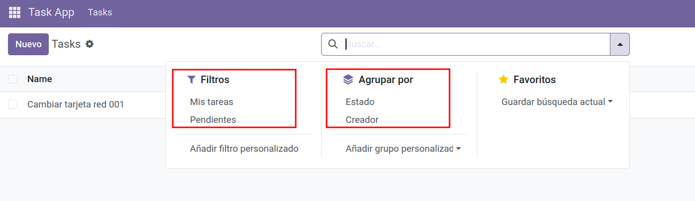

# Crear vista `<search>` para `task_model` con filtros útiles

En este paso añadiremos una vista de tipo **`search`** para `task_model` con filtros rápidos:
- **Mis tareas**: tareas cuyo campo `create_uid` sea el usuario actual.
- **Pendientes**: tareas con `is_done = False`.

---

## ℹ️ ¿Qué es un *domain* en Odoo?

Un **domain** en Odoo es una lista de condiciones que se utilizan para filtrar registros de un modelo.
Su sintaxis básica es:

```python
[('campo', 'operador', 'valor')]
```

📌 **Referencias oficiales**:
- [Documentación Odoo — Dominios](https://www.odoo.com/documentation/18.0/developer/reference/backend/orm.html#domains)
- [Vista Search y filtros en Odoo](https://www.odoo.com/documentation/18.0/developer/reference/views.html#search)

### Operadores más comunes:
| Operador  | Significado |
|-----------|-------------|
| `=`       | Igual a |
| `!=`      | Distinto de |
| `>` `<`   | Mayor / Menor |
| `>=` `<=` | Mayor/menor o igual |
| `ilike`   | Contiene (no sensible a mayúsculas) |
| `in`      | Está en una lista |
| `not in`  | No está en una lista |

### Ejemplo simple:
```python
[('is_done', '=', False)]
```
Devuelve registros donde `is_done` es `False`.

### Ejemplo con múltiples condiciones (AND):
```python
[('is_done', '=', False), ('create_uid', '=', uid)]
```
Devuelve tareas no realizadas y creadas por el usuario actual.

### Ejemplo con OR:
```python
['|', ('is_done', '=', False), ('create_uid', '=', uid)]
```
Devuelve tareas **pendientes** o **creadas por el usuario actual**.

---

## Añadimos los filtros a `views/task_views.xml`

**Ruta:** `task_app/views/task_views.xml`

```xml
  <record id="view_task_model_search" model="ir.ui.view">
    <field name="name">task_app.task_model_search</field>
    <field name="model">task_app.task_model</field>
    <field name="arch" type="xml">
      <search string="Search Tasks">
        <!-- Campo por el que se puede buscar -->
        <field name="name"/>

        <!-- Filtro: Mis tareas -->
        <filter name="my_tasks" string="Mis tareas"
                domain="[('create_uid', '=', uid)]"/>

        <!-- Filtro: Pendientes -->
        <filter name="pending_tasks" string="Pendientes"
                domain="[('is_done', '=', False)]"/>

        <!-- Agrupación opcional -->
        <group expand="0" string="Group By">
          <filter name="group_by_done" string="Estado" context="{'group_by':'is_done'}"/>
          <filter name="group_by_creator" string="Creador" context="{'group_by':'create_uid'}"/>
        </group>
      </search>
    </field>
  </record>
```

---

## Actualizar el módulo

### Desde la interfaz
1. **Ajustes → Activar Modo desarrollador**.
2. **Apps → Actualizar lista de aplicaciones**.
3. **Actualizar** el módulo **task_app**.

### Con Docker (CLI)
```bash
docker exec -it odoo18_web_1 sh -lc '
  odoo     --db_host=db     --db_port=5432     --db_user=odoo     --db_password="$(cat /run/secrets/postgresql_password)"     --addons-path=/usr/lib/python3/dist-packages/odoo/addons,/mnt/extra-addons     -d odoodb -u task_app --stop-after-init
'
```

---

## Verificar en la interfaz

1. Abre el menú **Task App → Tasks**.
2. En la barra de búsqueda verás:
   - Un campo para buscar por nombre.
   - El filtro **Mis tareas**.
   - El filtro **Pendientes**.
   - Opciones de agrupación por **Estado** y **Creador**.
3. Prueba combinarlos para filtrar y agrupar la información.

<figure markdown="span">
    {width="100%" }
    <figcaption>Filtros personalizados </figcaption>
</figure>

---

## Notas
- `uid` en el dominio representa el ID del usuario conectado.
- Los filtros y agrupaciones de `<search>` son acumulativos con otros filtros aplicados.
- Puedes añadir más filtros específicos (por ejemplo, tareas creadas hoy, tareas completadas, etc.).

---

## 📝 Actividad
!!! Question "Filtros personalizados"
    1. Crea los filtros personalizados que se han visto anteriormente en el modelo `task_model`  

