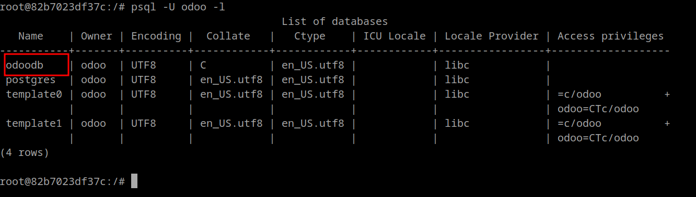
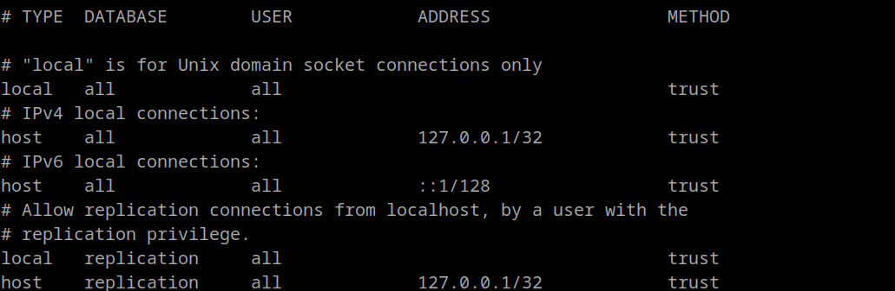
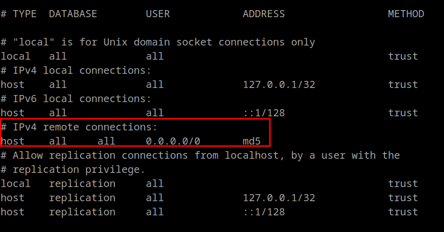
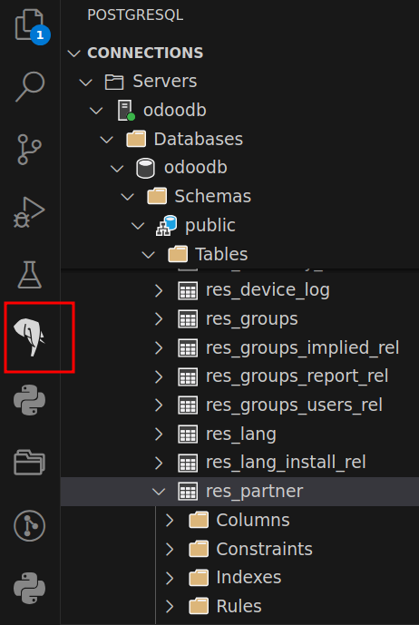

# 📂 Acceso a la Base de Datos PostgreSQL 

Vamos a ver cómo acceder a la base de datos **PostgreSQL** usada por Odoo cuando se ejecuta en un contenedor Docker, cómo configurar `pg_hba.conf`, y cómo explorar las tablas más importantes.

---

## 🐳 Acceso a PostgreSQL en un contenedor Docker

Si tienes Odoo y PostgreSQL ejecutándose en contenedores separados, el acceso a la base de datos se hace conectándote directamente al contenedor de PostgreSQL.

### 🔧 Conexión al contenedor de PostgreSQL

```bash
docker exec -it nombre_contenedor_postgres bash
psql -U odoo -d nombre_base_datos
```

- `nombre_contenedor_postgres` → Nombre del contenedor PostgreSQL.
- `odoo` → Usuario de base de datos por defecto creado por la imagen Docker.
- `nombre_base_datos` → Nombre de la base de datos de tu instancia Odoo.

Ejemplo para listar todas las bases de datos:

```bash
psql -U odoo -l
```
<figure markdown="span">
  {width="100%" }
  <figcaption>Listado de BD en PostgreSQL</figcaption>
</figure>

---

## ⚙️ Configuración del fichero `pg_hba.conf`

El archivo `pg_hba.conf` (ubicado normalmente en `/var/lib/postgresql/data/pgdata/`) controla **qué usuarios** pueden conectarse, **desde qué direcciones** y con **qué métodos de autenticación**.

Formato general de las entradas:

```
# TYPE  DATABASE        USER            ADDRESS                 METHOD
host    all             all             0.0.0.0/0               md5
```
<figure markdown="span">
  {width="100%" }
  <figcaption>Configurar acceso a PostgreSQL</figcaption>
</figure>

- **TYPE** → `local` (socket UNIX) o `host` (TCP/IP).
- **DATABASE** → Base de datos específica o `all` para todas.
- **USER** → Usuario permitido.
- **ADDRESS** → IP o rango permitido (ej. `192.168.1.0/24`).
- **METHOD** → Método de autenticación (`trust`, `md5`, `scram-sha-256`…).

💡 Para permitir conexiones remotas, cambia `listen_addresses` en `postgresql.conf` a:

```
listen_addresses = '*'
```

Y en `pg_hba.conf`, añade:

```
host    all    all    0.0.0.0/0    md5
```
<figure markdown="span">
  {width="100%" }
  <figcaption>Configurar acceso remoto a PostgreSQL</figcaption>
</figure>


> ⚠️ Recuerda reiniciar PostgreSQL tras cambios:
```bash
docker restart nombre_contenedor_postgres
```


---

## 💻 Iniciar shell de `psql`

Dentro del contenedor PostgreSQL, abre la shell con:

```bash
psql -h <servidor-postgresql> -p <port> -U odoo -d nombre_base_datos
```


Para salir de la shell de `psql`:
```sql
\q
```

---

## 📜 Comandos básicos de `psql`

| Comando              | Descripción |
|----------------------|-------------|
| `\l`                 | Lista todas las bases de datos |
| `\c nombre_db`       | Conectarse a una base de datos |
| `\dt`                | Lista las tablas disponibles |
| `\d nombre_tabla`    | Muestra estructura de una tabla |
| `\q`                 | Salir de `psql` |
| `SELECT version();`  | Mostrar versión de PostgreSQL |

---

## 📂 Acceso a la base de datos de Odoo

La base de datos de Odoo contiene todas las tablas que representan modelos de negocio.

Ejemplo de conexión directa:

```bash
psql -U odoo -d miempresa
```

### 🔍 Tablas más importantes en Odoo

| Tabla                | Descripción |
|----------------------|-------------|
| `res_users`          | Usuarios del sistema |
| `res_partner`        | Contactos, clientes y proveedores |
| `sale_order`         | Pedidos de venta |
| `purchase_order`     | Pedidos de compra |
| `account_move`       | Facturas y asientos contables |
| `product_template`   | Información de productos |
| `ir_model`           | Modelos internos de Odoo |
| `ir_module_module`   | Módulos instalados |

### 📌 Ejemplos de consultas

Listar los primeros 5 usuarios:

```sql
SELECT id, login, active FROM res_users LIMIT 5;
```

Listar clientes:

```sql
SELECT id, name, email FROM res_partner LIMIT 10;
```

---

## 🖥️ Conexión a PostgreSQL desde Visual Studio Code

Puedes conectarte a la base de datos de Odoo usando **Visual Studio Code** con la extensión oficial de PostgreSQL.

### 1️⃣ Instalar la extensión
- Abre **Visual Studio Code**.
- Ve a la vista de extensiones (`Ctrl+Shift+X` o `Cmd+Shift+X` en Mac).
- Busca **PostgreSQL** e instala la extensión oficial de Microsoft.

---

### 2️⃣ Obtener credenciales de conexión
En un entorno Docker típico con Odoo y PostgreSQL:
- **Servidor/Host**: nombre del contenedor PostgreSQL o `localhost` si expones el puerto.
- **Puerto**: `5432` (por defecto).
- **Usuario**: `odoo`.
- **Contraseña**: la definida en la variable `POSTGRES_PASSWORD` de tu `docker-compose.yml`.
- **Base de datos**: nombre de tu base de datos Odoo (por ejemplo, `miempresa`).

Si no conoces la contraseña, puedes verla con:

```bash
docker inspect nombre_contenedor_postgres | grep POSTGRES_PASSWORD
```
---

### 3️⃣ Configurar conexión en VS Code
1. Presiona `Ctrl+Shift+P` y escribe **PostgreSQL: New Connection**.
2. Introduce los parámetros:
   - **Server name**: `localhost` o nombre del contenedor.
   - **Database name**: `miempresa`.
   - **User name**: `odoo`.
   - **Password**: tu contraseña.
   - **Port**: `5432`.

3. Guarda la conexión para acceder rápidamente.

---

### 4️⃣ Ejemplo de conexión desde VS Code

Si tienes PostgreSQL expuesto en `localhost:5432` y tu usuario/contraseña es `odoo/odoo123`:

```
Server: localhost
Database: miempresa
User: odoo
Password: xxxxxx
Port: 5432
```

<figure markdown="span">
  {width="50%" }
  <figcaption>Acceso a PostgreSQL desde vscode</figcaption>
</figure>


---

### 5️⃣ Consultas rápidas desde VS Code

Una vez conectado, puedes abrir un archivo `.sql` y ejecutar consultas con la extensión.  
Ejemplos:

```sql
SELECT id, login FROM res_users;
SELECT name, email FROM res_partner;
```

La extensión permite:
- Navegar por tablas y esquemas.
- Exportar resultados.
- Ejecutar scripts SQL completos.

---

📚 **Recursos útiles**:
- [Documentación oficial de PostgreSQL](https://www.postgresql.org/docs/)
- [Documentación de Odoo](https://www.odoo.com/documentation/)


## 📘  Actividad
!!! Question "Acceso a PostgreSQL"
    - Actividad 1: Accede a postgreSQL a través de la consola.
    - Actividad 2: Instala la extensión PostgreSQL en vscode y configura el acceso a la BD. 

