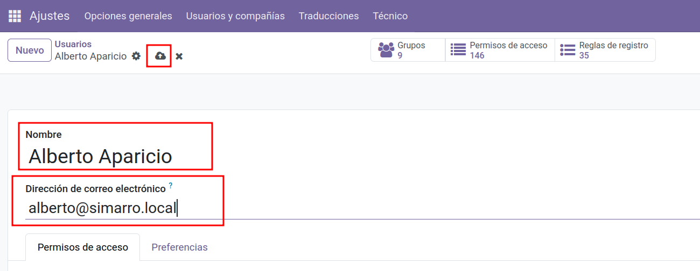

# 📚 Relación de tablas y modelos en Odoo 

Vamos a ver cómo [Odoo](https://www.odoo.com/documentation/18.0/) traduce los **[modelos](https://www.odoo.com/documentation/18.0/developer/reference/backend/orm.html#model-objects)** definidos en Python a **[tablas en PostgreSQL](https://www.postgresql.org/docs/current/ddl.html)**, con ejemplos visuales y actividades prácticas.

---

## Formato de nombres de tablas en Odoo

En Odoo, los **[modelos](https://www.odoo.com/documentation/18.0/developer/reference/backend/orm.html#model-objects)** se definen en Python con la convención `nombre.modulo`.  
Ejemplo:

```python
class ResPartner(models.Model):
    _name = 'res.partner'
```

En PostgreSQL, estos nombres se transforman a **[snake_case](https://en.wikipedia.org/wiki/Snake_case)** con guiones bajos:

| Modelo Odoo      | Tabla PostgreSQL |
|------------------|------------------|
| `res.partner`    | `res_partner`    |
| `sale.order`     | `sale_order`     |
| `account.move`   | `account_move`   |

📌 **Reglas de conversión**:

1. Punto (`.`) en el modelo → guion bajo (`_`) en la tabla.
2. Campos **[Many2one](https://www.odoo.com/documentation/18.0/developer/reference/backend/orm.html#odoo.fields.Many2one)** → columna con sufijo `_id`.
3. Tablas **[Many2many](https://www.odoo.com/documentation/18.0/developer/reference/backend/orm.html#odoo.fields.Many2many)** → formato:
   ```
   modelo1_modelo2_rel
   ```
   Ejemplo: `sale_order_res_partner_rel`.

---

## Relación tablas ↔ modelos ↔ apps

Cada tabla está asociada a un **[modelo](https://www.odoo.com/documentation/18.0/developer/reference/backend/orm.html#model-objects)** en Odoo, y cada modelo pertenece a una **[app](https://www.odoo.com/documentation/18.0/applications.html)** o módulo.

| **Tabla**         | **Modelo**       | **App**     | **Descripción** |
|-------------------|------------------|-------------|------------------|
| `res_users`       | `res.users`      | Base        | Usuarios internos |
| `res_partner`     | `res.partner`    | Base / CRM  | Contactos/clientes |
| `sale_order`      | `sale.order`     | Ventas      | Pedidos de venta |
| `account_move`    | `account.move`   | Contabilidad| Facturas/asientos |
| `stock_picking`   | `stock.picking`  | Inventario  | Movimientos stock |
| `project_task`    | `project.task`   | Proyectos   | Tareas de proyectos |

---

## Ejemplo: creación y consulta de un usuario

### Paso 1: Crear usuario en Odoo
1. **Inicia sesión** como administrador.
2. **Ajustes → Usuarios y Compañías → Usuarios**.
3. **Nuevo**:
   - Nombre: `Alberto Aparicio`
   - Correo: `alberto@simarro.local`
   - Rol: **Usuario interno**
4. **Guardar**.

<figure markdown="span">
  {width="100%" }
  <figcaption>Crear usuario en Odoo</figcaption>
</figure>

### Paso 2: Consultar en PostgreSQL
```sql
-- Buscar en res_users (credenciales)
SELECT id, login, active
FROM res_users
WHERE login = 'alberto@simarro.local';

-- Buscar en res_partner (datos de contacto)
SELECT id, name, email
FROM res_partner
WHERE email = 'alberto@simarro.local';
```
💡 **Nota**: `res_users.partner_id` apunta al registro en `res_partner`.

---

## URLs del backend y su relación con las tablas

### Formato clásico (Odoo <= 17)
En versiones anteriores, las URLs usaban el formato con **hash** y parámetros, por ejemplo:
```
/web#id=45&model=sale.order&view_type=form
```
📌 Significa:
- `id=45` → ID del registro.
- `model=sale.order` → Modelo Odoo → Tabla `sale_order`.

Consulta equivalente en PostgreSQL:
```sql
SELECT * FROM sale_order WHERE id = 45;
```

Más información: [Documentación de vistas y acciones en Odoo](https://www.odoo.com/documentation/17.0/developer/reference/backend/views.html).

---

### Formato nuevo (Odoo 18)
A partir de **Odoo 18**, el cliente web utiliza **rutas limpias** basadas en path, por ejemplo:
```
http://localhost:8069/odoo/contacts/7
```
o
```
http://localhost:8069/odoo/sales/45
```

Ventajas:
- Más legibles para el usuario.
- Mejor indexación para integraciones externas.

El **slug** (`contacts`, `sales`, `accounting`, etc.) depende del módulo o vista.

---

### Compatibilidad
- En muchos casos, si escribes la URL antigua (`/web#id=...&model=...`) Odoo 18 **redirige automáticamente** al formato nuevo.
- No todos los parámetros antiguos se preservan (por ejemplo, `menu_id`, `view_type`).

---

### Mapeo básico (antiguo → nuevo)
| **Antiguo**                           | **Nuevo**                 |
|---------------------------------------|----------------------------|
| `model=res.partner&id=7`              | `/odoo/contacts/7`         |
| `model=sale.order&id=45`               | `/odoo/sales/45`           |
| `model=account.move&id=102`            | `/odoo/accounting/102`     |

> El slug puede variar según la vista desde la que se accede al registro.

---


Cuando accedes a un registro en Odoo, la URL muestra datos clave:
```
/web#id=45&model=sale.order&view_type=form
```
📌 Significa:
- `id=45` → ID del registro.
- `model=sale.order` → Modelo Odoo → Tabla `sale_order`.

Consulta equivalente:
```sql
SELECT * FROM sale_order WHERE id = 45;
```

Más información: [Documentación de vistas y acciones en Odoo](https://www.odoo.com/documentation/18.0/developer/reference/backend/views.html).

---

## Consultas SQL útiles

- **Últimos 5 usuarios creados**:
```sql
SELECT id, login, create_date
FROM res_users
ORDER BY create_date DESC
LIMIT 5;
```

- **Pedidos de venta con cliente**:
```sql
SELECT so.id, so.name AS pedido, rp.name AS cliente
FROM sale_order so
JOIN res_partner rp ON so.partner_id = rp.id
ORDER BY so.date_order DESC
LIMIT 10;
```

---

## 📌 Actividades

### **Actividad 1: Relación modelo-tabla**  
En Odoo, las reglas de conversión de modelo a tabla siguen siendo las mismas que en versiones anteriores.

Dado el siguiente modelo Odoo:

Dado el siguiente modelo Odoo:
```python
class StockMove(models.Model):
    _name = 'stock.move'
```

1. ¿Cómo se llamará la tabla en PostgreSQL?
2. Si tiene un campo **[Many2one](https://www.odoo.com/documentation/18.0/developer/reference/backend/orm.html#odoo.fields.Many2one)** llamado `product_id`, ¿cómo aparecerá en la tabla?

---

### **Actividad 2: Análisis de URL**  
Analiza las siguientes URLs que apuntan al mismo registro:

**Formato clásico (Odoo <= 17):**
```
/web#id=102&model=account.move&view_type=form
```

**Formato nuevo (Odoo 18):**
```
/odoo/accounting/102
```

1. ¿Qué modelo está mostrando?
2. ¿Qué tabla de PostgreSQL se consulta?
3. Escribe la consulta SQL para obtener el registro.
4. Explica qué parte de la URL nueva (`/odoo/accounting/102`) corresponde al slug de la app y cuál al ID del registro.
5. ¿Qué ocurriría si en Odoo 18 introduces directamente la URL clásica en el navegador?
