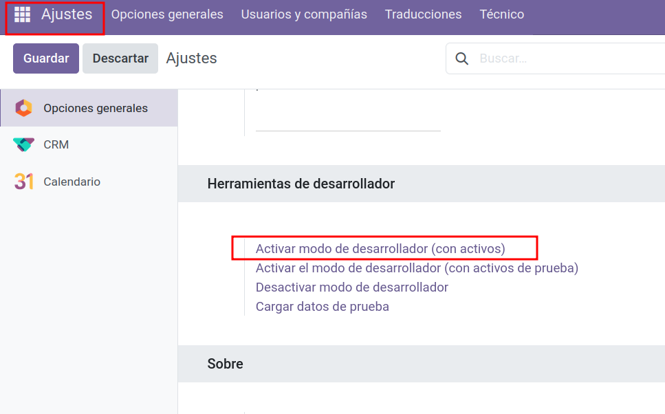
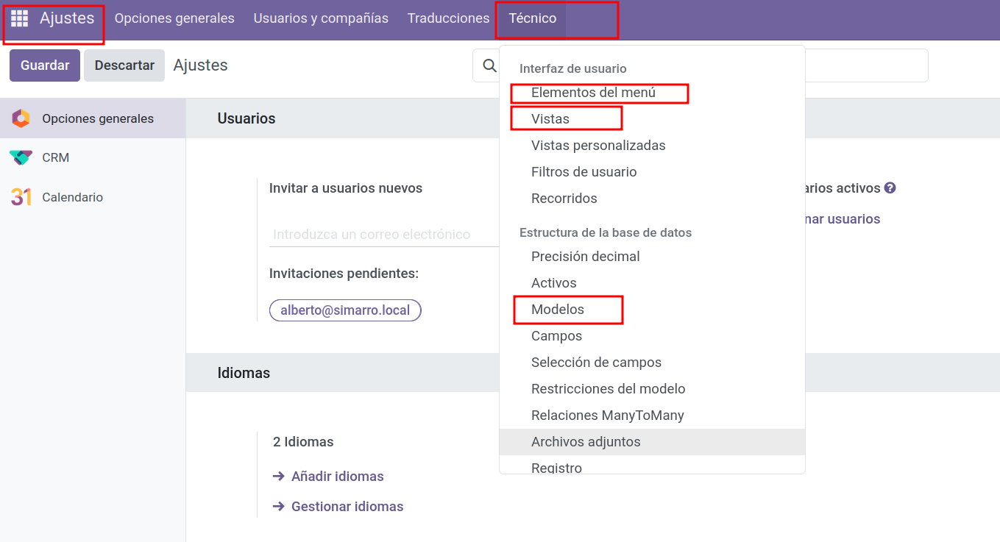

# 🌐 Interfaz web en Odoo 18 y patrón MVC

En este apartado vamos a ver cómo funciona la **interfaz web** de Odoo, su arquitectura **MVC**, los tipos de vistas, la definición de acciones y cómo inspeccionar modelos con el **modo desarrollador**.

---

## Odoo y el patrón MVC

Odoo sigue una arquitectura **[MVC (Modelo–Vista–Controlador)](https://en.wikipedia.org/wiki/Model–view–controller)** adaptada a su framework propio.

- **Modelo (Model)**  
    - Definido en **Python** en la carpeta `models/` de un módulo.
    - Corresponde a una **tabla en PostgreSQL** (ej. modelo `res.partner` → tabla `res_partner`).
    - Contiene la lógica de negocio y la estructura de datos (campos, relaciones, restricciones, métodos).

- **Vista (View)**  
    - Definida en **archivos XML** en la carpeta `views/` de un módulo.
    - Describe cómo se muestran los datos del modelo: formularios, listas, kanban, calendarios, etc.

- **Controlador (Controller)**  
    - Definido en **Python** en la carpeta `controllers/`.
    - Gestiona la lógica de las rutas web, APIs, control de flujos y lógica de backend para la interfaz.

Estructura de una app en Odoo:
```bash
app/
├─ __init__.py
├─ __manifest__.py
├─ controllers/
│  ├─ __init__.py
│  └─ controllers.py      # Controladores web (C del MVC)
├─ models/
│  ├─ __init__.py
│  └─ models.py           # Modelos ORM (M del MVC)
├─ views/
│  └─ templates.xml       # Vistas/plantillas (V del MVC, QWeb/XML)
└─ static/
   └─ description/
      ├─ icon.png
      └─ index.html
```
---

## Tipos de vistas en Odoo

En Odoo, cada vista se define como un elemento XML (`<form>`, `<list>`, `<kanban>`, `<calendar>`, etc.) vinculado a un modelo.

| **Tipo**     | **Etiqueta XML** | **Descripción** |
|--------------|------------------|-----------------|
| **Lista**    | `<list>`         | Vista tabular de varios registros |
| **Formulario** | `<form>`        | Vista detallada de un solo registro |
| **Kanban**   | `<kanban>`       | Vista en tarjetas con columnas (flujo visual) |
| **Calendario**| `<calendar>`    | Vista de eventos/fechas |
| **Gráfico**  | `<graph>`        | Visualización de datos en gráficos |
| **Pivot**    | `<pivot>`        | Análisis dinámico con tablas dinámicas |
| **Gantt**    | `<gantt>`        | Gestión visual de proyectos y tareas |
| **Mapa**     | `<map>`          | Ubicación geográfica de registros |

---

## Menús y navegación

Los menús de Odoo también se definen en XML con `<menuitem>`.  
Hay **tres niveles** típicos:

1. **Menú principal** (nivel superior) → ejemplo: *Ventas*, *Inventario*.
2. **Submenú** → agrupa funcionalidades dentro de un módulo.
3. **Acción de menú** → ejecuta una acción (`ir.actions.*`) que abre una vista o lista.

Ejemplo de definición en XML:
```xml
<menuitem id="menu_sales_main" name="Ventas"/>
<menuitem id="menu_orders" name="Pedidos" parent="menu_sales_main" action="action_sale_order"/>
```

---

## Acciones: `ir.actions.act_window`

Las acciones definen **qué modelo abrir, con qué vistas y en qué modo**.

- Se guardan en la tabla `ir_actions_act_window`.
- En XML:
```xml
<record id="action_sale_order" model="ir.actions.act_window">
    <field name="name">Pedidos de Venta</field>
    <field name="res_model">sale.order</field>
    <field name="view_mode">list,form</field>
</record>
```

**Campos clave:**
- `name` → Nombre mostrado.
- `res_model` → Modelo asociado.
- `view_mode` → Tipos de vista y orden de apertura (`list,form`, `kanban,form`, etc.).

---

## Modo desarrollador y menú técnico

Para explorar modelos, campos y vistas en Odoo:

1. **Activar modo desarrollador**  
     - Ir a **Ajustes**.
     - Abajo a la derecha: clic en *Activar el modo desarrollador* (o añadir `?debug=1` a la URL).

<figure markdown="span">
  {width="100%" }
  <figcaption>Modo desarrollador</figcaption>
</figure>

2. **Usar el menú técnico** (solo visible con modo desarrollador activo):
     - **Modelos**: `Configuración → Técnico → Modelos` → ver estructura, campos y relaciones.
     - **Vistas**: `Configuración → Técnico → Vistas` → inspeccionar XML y personalizar.
     - **Acciones**: `Configuración → Técnico → Acciones de Ventana` → ver y editar `ir.actions.act_window`.
     - **Menús**: `Configuración → Técnico → Menús`.

<figure markdown="span">
  {width="100%" }
  <figcaption>Menú técnico</figcaption>
</figure>


---

## Relación entre MVC y la interfaz

Ejemplo: Abrir la vista de contactos.

1. **Menú** → *Contactos* (`<menuitem>` que lanza una acción).
2. **Acción** (`ir.actions.act_window`) → `res_model="res.partner"` y `view_mode="kanban,form"`.
3. **Vistas XML** → `<kanban>` y `<form>` definidas para `res.partner`.
4. **Modelo** (`res.partner`) → Tabla `res_partner` en PostgreSQL.
5. **Controlador** (si aplica) → Si es una página personalizada, un controlador gestiona la ruta `/odoo/contacts`.

---

## 📌 Actividades

### 🔎 Actividad 1 — Explora un Modelo (res.partner)
**Objetivo:** Comprender cómo un **modelo** define estructura de datos y relaciones.

1. Abre **Contactos** y selecciona cualquier contacto.
2. Haz clic en el **depurador** (🐞) → **Ver campos** / **Ver modelo**.
3. Anota:
     - Nombre técnico del modelo (**`res.partner`**).
     - Tabla PostgreSQL asociada (**`res_partner`**).
     - 5 campos clave (nombre, email, phone, company_type, parent_id) y su **tipo** (Char, Many2one, etc.).
     - 2 campos relacionales y el modelo al que apuntan.
4. (*Opcional*) Verifica en PostgreSQL: consulta `SELECT * FROM res_partner LIMIT 1;` y comprueba columnas y tipos.

**Entregable:** Ficha del modelo con captura de la lista de campos y relaciones.

---

### 🧱 Actividad 2 — Localiza y lee las Vistas (list/form/kanban)
**Objetivo:** Ubicar las **vistas XML** que dibujan la UI de un modelo.

1. En Contactos, abre el **depurador** → **Ver vista**.
2. Identifica el **tipo de vista** en uso (p. ej., `form` o `kanban`).
3. Desde **Menú Técnico → Vistas**, busca por **Modelo = res.partner**.
4. Localiza:
     - Una vista **form** y una vista **list** (lista).
     - Su **ID externo** (ej. `base.view_partner_form`).
     - El archivo/fuente (módulo) al que pertenecen.
5. Lee el **XML** (campo *Arquitectura*). Localiza 3 campos y 1 botón (ej. `name`, `email`, `phone`, botón `action_archive`).

**Entregable:** Tabla con: *vista*, *tipo*, *ID externo*, *módulo*, *3 campos visibles*.

---

### 🧭 Actividad 3 — Rastrea el Menú y su Jerarquía
**Objetivo:** Entender cómo se construyen los **menús** que llevan a modelos/vistas.

1. Ve a **Menú Técnico → Interfaz de Usuario → Menús**.
2. Busca el menú que te lleva a **Contactos** (puedes filtrar por *Nombre contiene “Contactos”*).
3. Anota:
    - `Nombre`, `ID externo`, `Padre` (jerarquía) y **Acción** asociada (si tiene).
4. Dibuja la **jerarquía**: *Aplicación* → *Submenú* → *Elemento que ejecuta acción*.
5. Repite el ejercicio con **Ventas → Pedidos** (si el módulo está instalado).

**Entregable:** Diagrama simple (texto) de la jerarquía de menús para *Contactos* y *Ventas → Pedidos*.

---

### 🚪 Actividad 4 — Acciones de Ventana (`ir.actions.act_window`)
**Objetivo:** Ver cómo una **acción** decide qué modelo abrir y con qué vistas.

1. Abre **Menú Técnico → Acciones → Acciones de Ventana**.
2. Busca la acción que abre **Contactos**.
3. Anota:
     - `name`, `res_model`, `view_mode` (ej. `kanban,form`), `domain` (si aplica).
     - Vistas específicas vinculadas en la pestaña **Vistas** (si hay orden forzado).
4. Cambia a **Ventas → Pedidos** y repite con el modelo `sale.order`.

**Entregable:** Ficha de dos acciones con campos clave y captura de la pestaña **Vistas**.

---

📌 **Enlaces útiles**:

- [Documentación de vistas en Odoo](https://www.odoo.com/documentation/18.0/developer/reference/backend/views.html)
- [Documentación de acciones en Odoo](https://www.odoo.com/documentation/18.0/developer/reference/backend/actions.html)
- [Documentación del modo desarrollador](https://www.odoo.com/documentation/18.0/applications/general/developer_mode.html)

