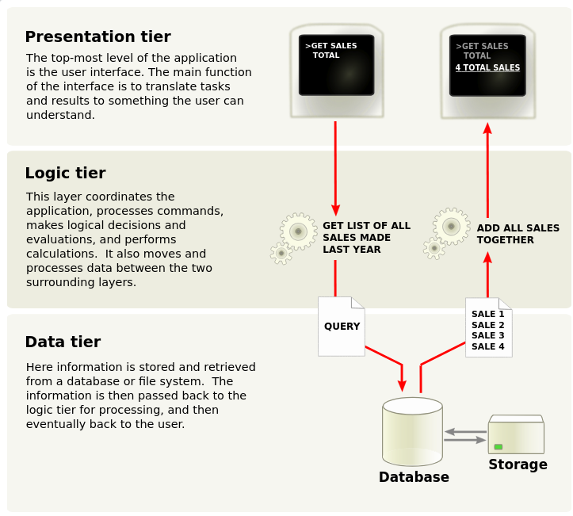

# Arquitectura de un ERP

## Integración

### Arquitectura modular
Dentro de las ventajas propias de esta integración se encuentran su gran poder de ajuste y adaptación. Sus bloques funcionales están estrechamente interconectados y se pueden contratar de forma independiente.

### Arquitectura indivisible
Este tipo de diseño arquitectónico permite contar con todas las funcionalidades desde el inicio. Estos sistemas son creados considerando a medida para solventar las necesidades específicas de un negocio. La desventaja principal es su inflexibilidad.

Desde una perspectiva técnica, los sistemas ERP se construyen basándose en dos elementos principales: **la base de datos** y la **arquitectura cliente-servidor**.

## Perspectiva técnica

### Arquitectura cliente-servidor
Se necesita un servidor que ofrece servicios a los clientes. De esta forma, los usuarios utilizan las aplicaciones clientes para acceder a los servicios de dicho servidor.

### Base de datos
La base de datos es común a todos los módulos de la aplicación, lo que permite la integración entre los diferentes departamentos o módulos del ERP. Normalmente las bases de datos que se utilizan son relacionales, por ejemplo: Oracle, MySQL o PostgreSQL. A la base de datos solo se puede acceder desde el servidor ERP, nunca desde los clientes. El servidor actúa como una capa intermedia entre los clientes y los datos.

## Descripción de la arquitectura de un sistema ERP libre: Odoo

La arquitectura del sistema **Odoo** es cliente-servidor, lo que permite trabajar sobre los mismos datos desde diferentes clientes. El servidor y los clientes pueden realizar el intercambio de datos mediante tres tipos de procedimientos: **XML-RPC**, **Net-RPC** o **JSON**.

<figure markdown="span">
    {width="90%" }
    <figcaption>Arquitectura de Odoo</figcaption>
</figure>

Odoo sigue una arquitectura **MVC** (Modelo-Vista-Controlador), en la cual:

- Los **modelos** se definen en las clases diseñadas con Python.
- Las **vistas** residen en formularios, listas, calendarios, gráficos, etc., definidos en ficheros XML.
- El **controlador** reside en los métodos definidos en las clases que proporcionan la lógica de negocio.

El framework de Odoo (denominado **OpenObject**, de tipo RAD) permite ampliar rápidamente el ERP a más módulos mediante la capa **ORM**, y facilita varios componentes que permiten construir la aplicación siguiendo la arquitectura MVC:

- La capa **ORM (Object Relational Mapping)** hace el mapeo entre los objetos Python y la base de datos PostgreSQL. El diseñador-programador no efectúa el diseño de la base de datos, únicamente diseña clases, las cuales son utilizadas por la capa ORM de Odoo para efectuar el mapeo sobre el SGBD PostgreSQL.
- Un sistema de **flujos de trabajo** o workflows.
- **Diseñadores de informes**.
- **Facilidades de traducción** de la aplicación a varios idiomas.

## Funcionamiento

El servidor Odoo proporciona acceso a la base de datos mediante ORM y a un cliente web. El cliente se comunica con el servidor usando **XML-RPC**, y los clientes web mediante **JSON-RPC**. El cliente solo tiene que mostrar lo que le envía el servidor.

Los datos están guardados en una **base de datos relacional**, y gracias al ORM no es necesario realizar consultas SQL directamente, ya que este proporciona métodos para trabajar de manera más rápida y segura.

Al hablar de **tablas**, nos referimos a **modelos**, que son mapeados por el ORM en tablas de **PostgreSQL**.

El acceso del cliente a los datos se realiza mediante un servicio llamado **WSGI**, una solución estándar para crear servidores y clientes HTTP en Python. En el caso de Odoo, este servicio incluye el **OpenERP Web Project**, que es el servidor web.

### Componentes adicionales en Odoo

- **Business Objects**: Casi todo en Odoo es un Business Object. Son persistentes gracias al ORM y se encuentran estructurados en el directorio `/modules`.
- **Wizards**: Se comportan como asistentes para introducir datos de forma más sencilla para el usuario.
- **Widgets o Windows Gadgets**: Permiten desarrollar fácilmente en el cliente, proporcionando visualización y comportamiento adecuados para cada tipo de datos.

## Resumiendo Odoo

A continuación se sintetizan los rasgos más importantes de Odoo en cuanto a tecnologías utilizadas, arquitectura, licencia y tipos de clientes:

| **Tecnologías que usa** | Python, SQL o PL/SQL, XML |
|--------------------------|----------------------------|
| **Arquitectura de diseño y funcionamiento** | MVC, PostgreSQL database server, Application server, Open Object, client web |
| **Licencia** | GPL |
| **Tipos de Cliente** | Web y aplicación Desktop |
