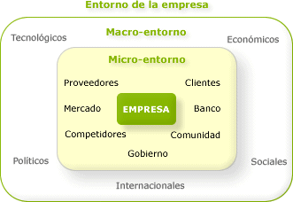

# Introducción a la gestión empresarial

La administración es la ciencia social que estudia las organizaciones y las técnicas relacionadas con la planificación, organización, dirección y control de todos los recursos (humanos, financieros, materiales, tecnológicos, del conocimiento, etc.) de una empresa, con el objetivo de maximizar tanto los beneficios como la eficiencia.  
Los beneficios de los que hablamos pueden ser sociales o económicos, esto depende de la finalidad de la empresa.

## Características de la administración:

### 🌍 Universalidad

Es la ciencia que permite coordinar tanto a personas como a sistemas con la finalidad, mediante comparaciones y jerarquías, de ser eficientes. La administración se usa en todos los ámbitos, ya sea el Estado, el Ejército, la empresa, con la ventaja de que los elementos básicos son los mismos en todos ellos, aunque por lógica existan variantes en cada caso.  
Diremos que la administración es universal si esta se puede aplicar a todo tipo de organismos.

---

### ✴️ Especificidad

La administración suele llevar implícitos algunos aspectos de diferente índole, pero ella es concreta y difiere de aquello que incluye. La administración tiene características específicas que nos permiten no confundirla con otras ciencias o técnicas.  
La administración tiene sus propias características que le proporcionan su especificidad.

---

### ⏳ Unidad temporal

Aunque la administración conste de diversas etapas, fases y elementos, en todo momento de la vida de una empresa se van a dar la mayoría de estos elementos, ya sea en mayor o menor grado.

---

### 🏢 Unidad jerárquica

Todos los representantes de la organización y los que forman parte de la misma participan de forma diferente y con diferentes grados de la administración, es decir, se establecen por niveles (directores, subdirectores, etc.).

### Valor instrumental
La administración es un medio para conseguir un fin; es decir, se utiliza en los organismos sociales para conseguir de forma eficiente los objetivos establecidos.

### Interdisciplinariedad
La administración hace uso de los principios, procesos, procedimientos y métodos de otras ciencias relacionadas con la eficiencia en el trabajo, como por ejemplo las matemáticas, la estadística o el derecho, entre otras muchas.

### Flexibilidad
Ser flexible significa que cualquier principio o técnica administrativa se puede adaptar según las necesidades de la empresa.

## Organización de una empresa y sus relaciones
El entorno de una empresa son aquellos elementos y factores relevantes externos a la misma y que pueden influir en su funcionamiento. En cada entorno podemos distinguir dos tipos de factores: los que afectan de forma global a todas las empresas (macroentorno) y los que afectan de forma individual (microentorno).

<figure markdown="span">
    {width="100%" }
    <figcaption>Microentorno vs macroentorno</figcaption>
</figure>

