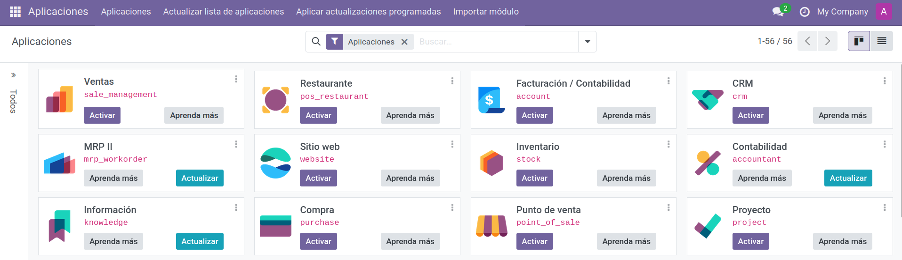
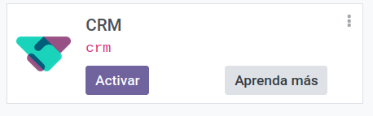
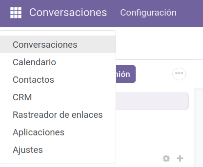
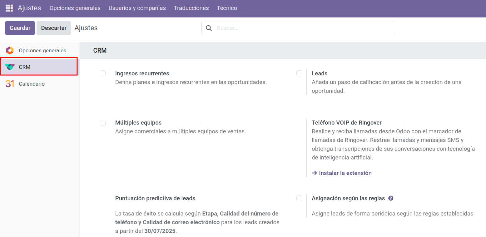

# Instalación de módulos en Odoo

## Módulos propios del ERP

Como hemos comentado, el ERP **Odoo** es modular; esto implica que cada proceso que ejecuta la empresa lo tenemos por separado en módulos.  
Los módulos se pueden instalar dependiendo de las necesidades de cada empresa, es decir, podemos instalar cualquier módulo que necesite la empresa, ya sean webs, compras, ventas, producción, etc.

En este sentido, al utilizar un ERP modular nos permite ampliar su uso y su funcionalidad basándonos en las necesidades de la empresa a medida que esta vaya creciendo o para facilitar su implantación.

Además de los módulos propios que podemos instalar en Odoo, existen otros módulos creados por terceras personas o por nosotros mismos que también podemos instalar en Odoo.

---

### En el cliente

Todos los módulos que lleva Odoo los podemos encontrar en el cliente web y en el servidor.
Desde el cliente web accedemos a Odoo y, en el **Menú principal**, tenemos el submenú **Aplicaciones**. 
<figure markdown="span">
    {width="900%" }
    <figcaption>Módulos Odoo</figcaption>
</figure>

Aquí nos aparecen los módulos que podemos instalar.  
Es posible buscar por nombre y desde esta ubicación podemos instalar directamente cualquier módulo que necesitemos.

**Ejemplo:**

Uno de los módulos que encontramos es **CRM**, como ya hemos dicho anteriormente en el módulo de la relación con los clientes.
Para instalarlo simplemente habría que darle al botón **Activar** y automáticamente se instalaría.

!!! tip "Módulo CRM"
    <figure markdown="span">
        {width="50%" }
        <figcaption>Módulo CRM</figcaption>
    </figure>

Para instalar cualquier otro módulo propio seguiremos el mismo procedimiento.
Una vez instalado este módulo vemos que nos ha ampliado el menú principal y ahora aparecerá de la forma siguiente:

| Módulos Instalados                                                                 |                                                                  |
|-----------------------------------------------------------------------------|----------------------------------------------------------------------------|
| - Conversaciones - CRM - Calendario - Contactos - Tareas - Aplicaciones | <figure markdown="span"> {width="50%"}<figcaption>Módulos instalados</figcaption></figure> |

Si vamos a Ajustes veremos que también se ha modificado y queda de la forma siguiente:

<figure markdown="span">
  {width="100%" }
  <figcaption>Módulo CRM</figcaption>
</figure>

### En el servidor

Desde el servidor podemos acceder a la ubicación de los módulos de Odoo, que encontramos en la ruta de instalación de Odoo, en la carpeta `/usr/lib/python3/dist-packages/odoo/addons`.

### Módulos externos al ERP

Actualmente existen una gran variedad de módulos desarrollados por terceras personas, que están disponibles para ser instalados en Odoo.

Como estos módulos no se encuentran en el propio Odoo, el proceso de instalación es diferente al del resto de módulos propios.

Existen repositorios desde los cuales podemos obtener estos módulos, sin coste adicional para la versión Community. Dos de los repositorios son:

- [OCA Community](https://odoo-community.org/shop) 
- [Odoo Apps](https://apps.odoo.com/apps)

!!! info "IMPORTANTE"

    Podemos añadir tantas carpetas como deseemos en el `addons_path`. Simplemente hay que usar la coma (`,`) para separarlas.

## 📝 Actividad
!!! Question "Instalación de un módulo en Odoo"
    1. Tenemos una empresa que se dedica a la reparación y venta de hardware y nos piden que analicemos qué módulos deberíamos instalar en nuestro ERP y por qué.

